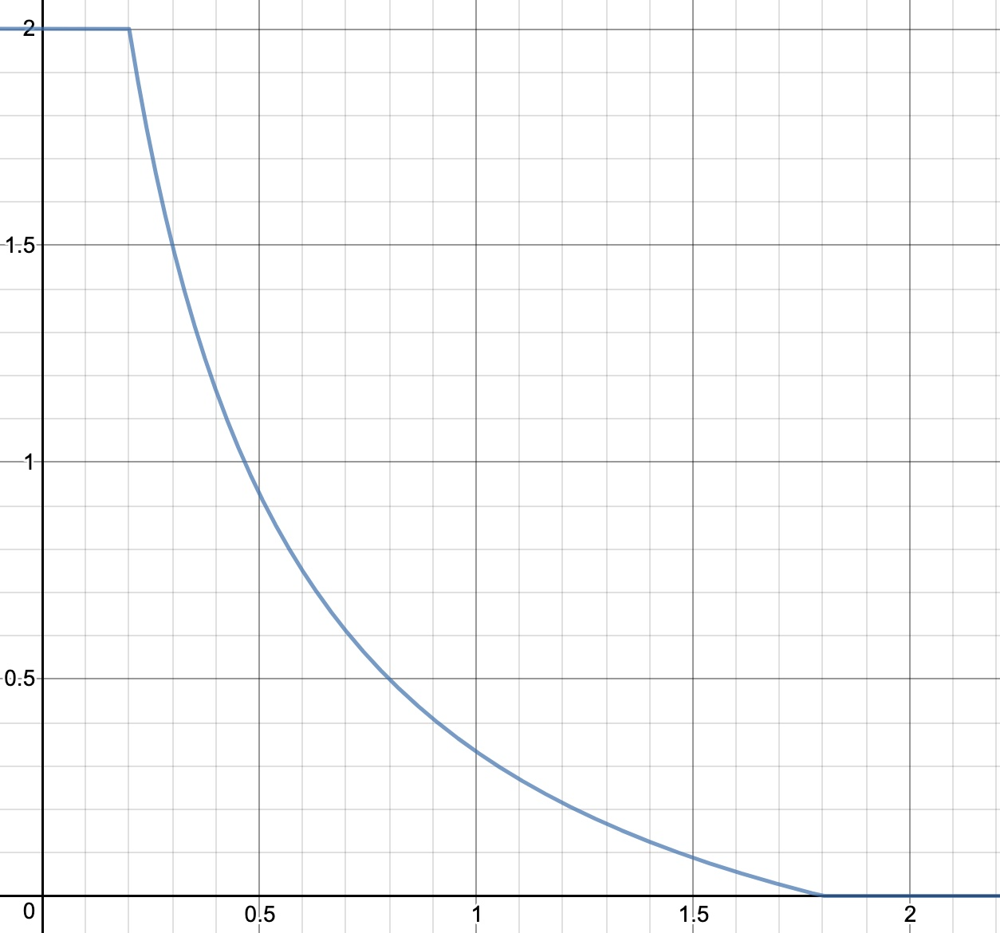

# Proof of Carbon Reduction Whitepaper

2021 has seen an increase of the financial sector adoption of the public blockchains to host financial instruments and to operate their ownership trasnfer against cash instruments (CBDC, Stable coins ...).

Large institutions, public and private, in Europe and Asia mostly, are investing and are pushing their market to invest in the blockchain sector, considering that the blockchain technology can become progressively a substitute infrastructure for the financial market.

Indeed, public blockchains are an IT infrastructure run by parties with motivations independant of the infrastructure usage.   
This paper is not about discussing the history and background of blockchains, but let's just remind ourself that the main reason why nodes run consistently a consensus based infrastructure is because of their individual interest in earning a crypto currency they can sell to the highest bidder.

In this paper we propose a new consensus at the base of a new public blockchain to embed an incentive to improve the ecological impacts of the IT infrastructure.  

## 1. The problem to solve

The human civilisation is in an era where the ecological impacts of its activities has become a growing concern and this concern is becoming a driving force for multiple policies. These policies are helping but they are often hindered by the additional financial investment that positive ecological impacts takes.   
Human nature is often driven by self interests that sometime coincide with the common interest but sometime doesn't. And it appears that in the ecological situation the global interest is often not aligned with self interest.

In the sole scope of IT infrastructure, the demand for storage, network and computational power is increasing and these services requires energy, rare materials and often use hardware insufficiently recycled. If research and development exists in improving the ecological quality of the infrastructures, we believe it could be increased.

Blockchain technologies, concretized by Satoshi Nakamoto with bitcoin, and improved by Vitalik Butterin with Ethereum, and many others since, have exploited self interest of individual to create a greater good in the form of a shared IT distributed infrastructure used to securely transfer value and run computational and storage logics with no central authority. The self interest leveraged by this type technology is the earning of a new form of asset (called crypto currencies) that obtain a monetary value when sold to those who need to use the IT infrastructure it powers.

This paper will not document, nor explain, the fundamentals of a public blockchain and the readers are directed to the 2 most relevant whitepapers for [Bitcoin](https://bitcoin.org/bitcoin.pdf) and [Ethereum](https://ethereum.org/en/whitepaper/). Plenty of litterature exists on this subject and the reader is expected to understand the principles that construct public blockchains.    
However we have to make a focus on the consensus algorithm that drives the blockchain infrastructures. These algorithms are designed as a set of rules that all individual parties (nodes) in the network must be able to follow independently to construct and propose new blocks and to validate new blocks received from other nodes. It is the collective behaviour of the individual decisions that form the network and the infrastructure and it generally takes the form of a competition. 

The most commonly known consensus is the `Proof of Work` (Bitcoin, Ethereum) where any node is allowed to propose a new block as long as it is has a coherent structure (linked to the head of the chain, valid transactions ...) and has a valid hash that implies a lots of computation. If very robust, the proof of work consensus has a very negative image due to the very high level of energy consumption that nodes must put to participate into the competition of building blocks ([The Energy Consumption of Blockchain Technology: Beyond Myth](https://link.springer.com/article/10.1007/s12599-020-00656-x) ). Beyond the image there is a reality that such technology is not sustainable.

Ethereum is migrating its consensus to the `Proof of Stake` (2022) and other public blockchain are already running on such protocol (Tezos, Polkadot, Hedera). In proof of stake the energy consumption is strongly reduced since the competition to create the block is replaced by a pseudo-random selection of the node base on their stake of crypto currency. Hence the need for redundant calculation of finding a valid block is removed from the consensus lowering the energy consumption by a 100 thousand factor. 

Proof of Stake is indeed a huge progress, yet there is no incentive for the nodes to optimize their energy consumption and use computing hardware that are optimal.

In this whitepaper, we propose to develop a new consensus that will incentivize the the nodes to select the best setup to run their node and enter into a competition for continuous improvement of their hardware, not only on the energy consumption but also in the ecological impact of the lifecycle of the infrastructure they choose to use. We call this consensus the `Proof of Carbon Reduction` or `PoCR`.

## 2. The mechanic of incentivizing carbon footprint reduction 

Nodes will make efforts in improving the carbon footprint of their IT infrastructure if they are given a financial incentive to do so.   
The **Proof of Carbon Reduction** consensus therefore aims at aligning the reward of a block to the quality of the carbon footprint of the infrastructure.   
This implies that the nodes can proove their level of carbon emission of their infrastructure to the rest of the network in a trustable and public way.   

The consensus intends to put the nodes in competition for the best carbon footprint since the lower the footprint the higer the reward, and the absence of progress on the carbon footprint could disqualify the node from any reward.   
The reward will be denominated in the native crypto currency of this new public blockchain and therefore, like any other shared infrastructure, the reward will gain a monetary value by the increased usage on the infrastructure. So the earning of a node will be higher if the node can demonstrate to run with a better setup than the average of the nodes.

We introduce here the notion of the average footprint of the nodes and we believe this is an important factor of long term success.   
The competition between the nodes will push the actors to favor better ecological equipments and progressively all nodes will improve the footprint by getting these equipments. This global improvement should not stop the competition but set new challenges. As all the nodes improve, the average improve. The best node yesterday can lag behind the average if it stop improving while other do. 
Therefore, we can look at the average footprint of the nodes as the level to beat in this competition that never stop. 

Will we reach a zero footprint impact ? If so we would have achieved something good : An IT infrastructure that has no negative impact on the planet !   
Note that we should therefore exclude carbon compensation scheme in the measurement of the node without preventing actors to compensate if they wish to do so. 


## 3. Calculating the carbon footprint of a node

Let's detail now how the carbon footprint of a node is estimated, recorded, shared and made trustable. 

An IT software cannot (yet) determine by itself the energy, CO2, and other environmental factors that it has an impact on. Therefore the nodes will rely on the expertise of external parties to assess the node infrastructure. 

First, the research suggest that a large part (70%) of the environmental impact of IT infrastructure comes from the construction and shipment of the hardware before it is even first used. Another important part is linked to the management of the end of life of the equipments after it has been put out of use. So it is critical that the node assessment is done on the full lifecycle (construction, shipment, installation, usage, end of life) of the various parts that constitute a node : computer hardware, storage units, network appliances, cooling systems, electricity sources etc.

Then it is important that we can apply consistently the same assessment methodology across all nodes, across multiple data center and geography, and across time. Such a methodology must therefore be designed by experts in this field of research.   

Typically, the footprint of a node will be measured in "greenhouse gas" emissions following the [IPCC 100 years methodology](https://www.ipcc.ch/site/assets/uploads/2018/02/ar4-wg1-chapter2-1.pdf) and be expressed in kg of CO2 equvalent.

**TO BE COMPLETED AFTER THE PARTNER IS SELECTED WITH THE METHOLOGY**

Since nodes themselves, as IT software cannot self assess their setup, since there are financial implications (the blocks rewards) in making this assessment node owners cannot be trusted to self assess their nodes either. So external trustable parties, with at least their names at stake, should be entrusted to analyse the nodes setup.    
As it is important to maintain, as much as possible, a distribution of roles and avoid unique actors and centralization, these parties must be multiple and remain independant and in competition. We will refer to these parties as node auditors or node carbon footprint agency with a role similar to the rating agencies we have in the financial sector. 

These node auditors will be mandated by the node owner to assess their IT infrastructure and must follow the defined methodology and be in a position to demonstrate that the methodology has been followed. Once an assessment is done on a node, they will record in the Blockchain the carbon footprint of the node under their signature (i.e. making a blockchain transaction with their individual private keys). 

Only conformant auditors will be authorized to record the result of an audit in the chain. The community of node owners will have the right to vote in or out an auditor with a majority + 1. Auditors will be encouraged to review the audits of their peers and expose any wrong doing. One additional way to ensure auditors honesty would be to have the auditors set an amount of crypto currency at stake to be allowed to record the result of an audit. If an auditor is voted out it will loose it's stake. If the auditor decide to exit its stake, it can do so only after a given period (to be defined) since it's last audit to give enough time for external actors to eventually expose the auditor. The amount at stake can be defined as a function of the number of audits performed. **TO BE FURTHER DEVELOPPED**. 

Node owners identity will have to be known and be transparent to the community. They cannot be also auditors as it would possibly create a conflict of interests.   
The identity of the node owners should be known because the auditors will need to collect documentation and data and ensure that these are the actual figures of the nodes. 
The identity of the node owners are also expected to be public to enable public display of the nodes activities. Finally, as we will see in the next section the identity of the nodes will be important to decide to allow a new member in the groupe of block builders. 

## 4. Deriving from the proof of authority consensus

This new blockchain wants to offer an alternative to the market by being a public "green blockchain" that has also an important throughput compare to existing public blockchains. The financial sector in particular and many large corporate businesses is looking for such a blockchain since they have taken ESG commitment and they cannot afford to have their name linked to an energy intensive infrastructure.    
In addition, the regulated markets have difficulties to accept working on public infrastructures where the crypto currency can fuel unknown actors that would potentially be suject to sanctions or linked to illegal activities. Therefore, there is a need for an open public infrastructure, yet cleared from disqualified actors for these sectors of businesses.   

The `proof of authority` consensus is designed to only allow a known set of nodes to create blocks. In particular the [clique](https://eips.ethereum.org/EIPS/eip-225) implementation proposed in EIP 255 of the Ethereum community, defined a replacement for the `proof of work` consensus that would be a good base to implement the `proof of carbon reduction` consensus.

In the clique consensus, nodes are identified by an ethereum address corresponding to the private key with which they will sign their blocks. Nodes do not receive rewards for creating blocks and they are not put in competition. The list of authorized nodes (addresses) are simply requested to create blocks, in turn, at a regular frequency. They are called sealers in this consensus as they simply apply their signature on a block. The other nodes receiving this newly created block will verify that the block is valid and that the sealer is legit, before adding it into their copy of the chain. If the expected sealer did not send a block in the given timeframe, any block is allowed to take its place, ensuring redundancy in case of a node failure.

At the genesis of the chain, a single sealer is enough. It can allow new sealers in the consensus by voting in its address. Each new sealer needs to be voted in by at least N/2 + 1 existing sealers, N being the total number of authorized sealers. Similarly, a node that is not acting positively in the consensus can be voted out by at least N/2 + 1 nodes to be excluded from the consensus.

To ensure that a node cannot seal a long consecutive set of blocks, and control the chain, there is a rule in clique that prevents a sealer to seal another block until at least N/2 blocks have been sealed. So in a 10 nodes setup, node #1 will at best be able to seal block `X` then at the earliest block `X+(10/2) = X+5`.

We would copy this behaviour and give an financial reward to the sealers making blocks based on their carbon footprint quality and on the number of nodes involved. The reward should deliver an incentive to improve their individual carbon footprint and at the same time give an incentive to accept more nodes in the the consensus to avoid a too small group of nodes. Finally, once sufficient activity has peaked up on the platform the transaction fees should replace the block reward to limit the crypto currency creation.

On this last element, controlling the block reward level based on the chain activity, means here to use the transaction fees as an alternate source of reward. The Bitcoin network has taken the view that progressive usage of the network will enable the halving of the block reward while maintaining enough miner reward with the tx fees. Ethereum consensus (prior to proof of stake) has a more interventionist policy on the block reward (difficulty bombs).

## 5. Calculating the reward of a node and the incentive scheme (Tokenomics)

Based on the above discussion, the block `b` reward of a node `n` should be made up of 3 parts to control the 3 incentives: 

**`Reward(n, b) = CarbonReduction(n) * AcceptNewSealers() * GlobalInflationControl(b)`**

### 5.1. The `CarbonReduction` reward

The logic is to place a node in a cohort of nodes based on the quality of its carbon footprint (a value expressed in grams of CO2 eq. with no decimals).   
The nodes with a very good carbon footprint should be receiving a larger premium than one with a good one who in turn receives a better premium than some node with a average or even bad footprint. The intention is not to make this additional footpring linear since in technology, additional important breakthrough are often much more difficult to get than incremental improvement. Therefore a `f(x) = 1/x` curve seams adhequate (the lower the higher, the larger the smaller).

As we have seen the average footprint of all nodes is a better reference than a static reference as with time all nodes will improve, leaving the static reference behind. So we consider the average `Avg`:

`Avg = 𝛴 F(n) / N ` where `N` is the number of enlisted nodes and `F(n)` the carbon footprint of node `n`.    
To be noted that the value `F(n)` is a positive number (any carbon compensation setup would be ignored and an assessment of carbon footprint that would be negative wouldn't make sense). So `Avg` is a positive number.

Then, we define the no unit `Ratio` to measure a form of distance of the current node footprint to the average:

`Ratio = F(n) / Avg`.

We then we say that a low ratio (below 20% of the average) will have a maximum reward (2 units) to prevent a breakthrough to create too much desequilibrium in, the crypto creation. Also, a ratio that is too large (80% more than the average) will not earn any reward. So we can write the carbon reduction factor `CRF(n)` as follow:

`CRF(n) = Min( Max(1 / (Ratio + 0.2) - 0.5, 0), 2)` where `n` is the current node.    
`CRF(n) = 0` when `Ratio = 1.8` or 80% more than the average.   
At the average (`Ratio = 1`) the reward is `1/3rd` of a unit.



Finally :    
**`CarbonReduction(n) = CRF(n) * 1 crypto unit`**

### 5.2. The `AcceptNewSealers` reward

Here the logic is to provide the early adopter nodes to get an incentive to accept new nodes n the consensus.    
With the proof of authority consensus, each allowed nodes are expected to seal a block in a round robin way (each in turn). So, given that the blocks are created every `S` seconds (initially set to 4 seconds) it means that when new nodes are brought into the game, the average reward per unit of time will drop for the existing nodes.   

A node `n` within `N` nodes will in average earn `1/3 crypto unit` every `N` blocks or `1/3N` per block in average.  

When a new node is added into the consensus, the total number of nodes becomes `N+1` and the the node `n` will now earn in average `1/3 * 1/(N+1)` per block. 

Therefore the node loses in average `1/3 * ( 1/N - 1/(N+1) )` per block over `N` block. 

Adding yet another node (total `N+2` nodes), node `n` will now earn `1/3 * 1/(N+2)`, loosing `1/3 * [ 1/N - 1/(N+2) ]` per block. 

The first node will therefore loses this amount for each new node being added, so theoretically in average `1/3 * 𝛴 (1/i - 1/(i+1))` per block which simplifies into `1/3 * (1 - 1/N)`

So when its time for the node to seal a block, it should be granted an additional an amount that will at least compensate for the loss over the upcoming `N` blocks : `N/3 * (1 - 1/N)` or `1/3 * (N-1)`


In reality all nodes do not earn `1/3 crypto unit` per mined block but their reward depends on their carbon footprint performance. But as we have seen the reward gets diluted as more nodes comes in. If the node is granted a fixed amount (1/3) per new block then its individual performance will become insignificant compare to the static reward.

Therefore in order for the node to be awarded its performance regardless of the number of nodes, the block reward should be multiplied by the number of nodes until the node can next seal a new block : `N`

**`AcceptNewSealers() = N`**

### 5.3. The `GlobalInflationControl`

With the above rules, the crypto currency creation is linear with a static number of nodes `N` as `N/3 crypto unit` per block in average.   
Increasing the number of nodes will increase proportionnally the monetary creation and this will dillute the value making a inflationary market.

It is therefore necessary at the start of the network to encourage nodes to join the consensus but once the network has reached a large enough number of nodes the crypto creation should progressively reduce.

The logic here is to look at the amount of crypto created as the number of blocks since the start of the chain times the number of nodes (`b * N`).    
The number of blocks will give a measure of time (with a 4 seconds delay between blocks, it is 8 000 000 blocks per year that are created).    
The number of nodes gives an idea of the size of the network and its usage.   

So we can propose a scheme when `b * N` reaches a level of a year equivalent with 30 nodes the creation of crypto is halved. When it reaches twice this (either because the nodes increase or time passes) the creation of crypto is halved again.

The calculation will be as follow:
```js
L = (b * N) / (8 000 000 * 30) // as integer value
D = 2^L // The divisor : 2 at the power of L
GlobalInflationControl = 1/D // 1; 1/2; 1/4; 1/8 ....
```
The chart represents the total amount of crypto created by number of blocks on a static number of nodes.  


Finally:

**`GlobalInflationControl(b) = 1/2^(b*N/240e+6)`**

### 5.4. The `GlobalInflationControl` alternative

Another approach can be to more precisely control the amount of cryptocurrency created.
Since the actual amount depends of the nodes footprint, the entry of nodes in the consensus, it will be necessary to keep track of the crypto creation.   

Let's assume that there is a record in the blockchain of the total amount created `M` then the inflation can be controlled by a halving scheme based on `M`:

We still consider the year worth of creation (8 millions blocks by a group of 30 nodes) that would generates `30 * 8 000 000 * 1/3 crypto units = 80 000 000 units`

The calculation will be as follow:
```js
L = M / (8 000 000 * 30 / 3) // as integer value
D = 2^L // The divisor : 2 at the power of L
GlobalInflationControl = 1/D // 1; 1/2; 1/4; 1/8 ....
```

Finally:

**`GlobalInflationControl(b) = 1/2^(M/80e+6)`**

This approach would be more precise and will give better chances to the network to grow at its own pace that is difficult to estimate upfront. Also, it will give a better clarity to the market of this crypto currency of the actual evolution of the amount of currency.

## 6. Monetary policy of the crypto currency

In the proposed model, the quantity of crypto currency issued in the network will reach an asymptotic amount at `16/3 10^7 crypto units`.    
Unlike the bitcoin network, there will be not hard stop of producing the crypto currency. But from a computer standpoint, as the calculations are done on big numbers (with 18 significant numbers), it will finally round to zero after a long time.

The time it will take to reach a 1/32e increase (3%) is 5 times the times it takes to halve the increase.

With a single node it can be 150 years; with 15 nodes it will be 10 years; etc.

The users of the network infrastructure will spend crypto to submit transactions.    
The nodes have the possibility to set the minimum gas price `--miner.gasprice` option. By default it is 1 000 000 000 Wei = 1 GWei.    
The blocks will have an average gas limit at the current default gas limit in geth : 8 000 000 gas.  

So the expected total amount of Gwei that a node can earn from the transactions is 0,08 crypto unit. This is probably too low for the begining of the network as only a few transactions will be sent.

Nodes, to be able to sell enough of their crypto to cover their operational costs, would expect higher gas price. We could expect the initial gas price to be 1 to 10 crypto units. 

## 7. Implementing the consensus

Starting with the go version (why?)

## 8. Attack vectors and remediations


## 9. Opening to the community

## 10. References

* [The Energy Consumption of Blockchain Technology: Beyond Myth](https://link.springer.com/article/10.1007/s12599-020-00656-x)
* [Energy Footprint of Blockchain Consensus Mechanisms Beyond Proof-of-Work](https://arxiv.org/pdf/2109.03667.pdf)
* [Green-PoW: An Energy-Efficient Blockchain Proof-of-Work Consensus Algorithm](https://arxiv.org/pdf/2007.04086.pdf)
